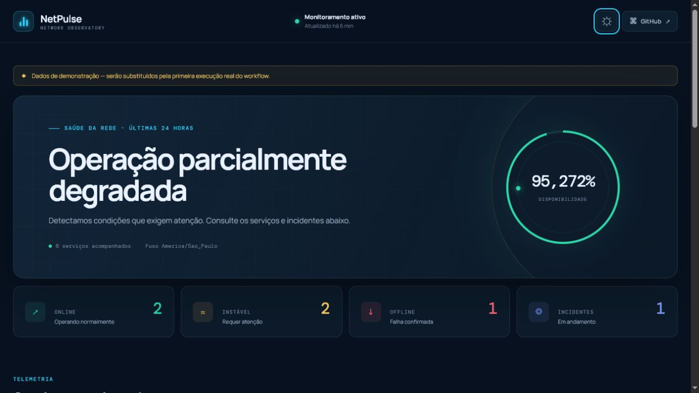
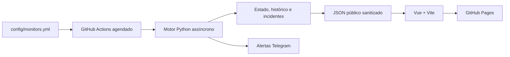

# NetPulse Monitor

Painel serverless de disponibilidade, latência e incidentes, executado periodicamente pelo GitHub Actions e publicado como site estático no GitHub Pages.




> A demonstração pública será indicada aqui somente depois que o deployment for executado e validado. O projeto local já pode ser explorado com os dados seguros da CLI `demo`.

## Visão geral

O NetPulse monitora HTTP/HTTPS, conteúdo, APIs JSON, TCP, DNS e certificados TLS sem manter um servidor ou banco externo. A cada execução, o motor Python recupera o histórico, executa verificações concorrentes, atualiza incidentes, entrega alertas pendentes e gera três JSONs sanitizados consumidos pelo painel Vue.



## Funcionalidades

- Verificações HTTP/HEAD, keyword, JSON com assertivas, TCP, DNS e TLS validado.
- Concorrência limitada, timeout por alvo e retries apenas em operações idempotentes.
- Estados `unknown`, `up`, `degraded`, `down` e `maintenance` com limiares configuráveis.
- Incidentes determinísticos, alertas de queda/recuperação e fila durável do Telegram.
- Histórico bruto de 24 horas, agregados horários por 30 dias e retenção de incidentes.
- Painel responsivo em português, temas claro/escuro, filtros, gráficos e detalhes acessíveis.
- GitHub Pages estático sob `/netpulse-monitor/`, CI, deployment agendado e Dependabot.

## Execução local

Requer Python 3.11+ e Node.js 22+.

```bash
python -m pip install -e ".[dev]"
python -m netpulse.cli validate-config --config config/monitors.yml
python -m netpulse.cli demo --output frontend/public/data

cd frontend
npm ci
npm run dev
```

Acesse a URL indicada pelo Vite. Os dados de demo são explicitamente marcados e incluem seis serviços, todos os estados, 24 horas de histórico e incidentes abertos/resolvidos.

## Configuração dos monitores

Edite `config/monitors.yml`. IDs devem ser únicos e usar apenas letras minúsculas, números, `_` ou `-`. URLs precisam de `http://` ou `https://`, não podem conter credenciais, e métodos HTTP são limitados a `GET` e `HEAD`.

```yaml
schema_version: 1
settings:
  timezone: America/Sao_Paulo
  default_timeout_seconds: 8
  default_failure_threshold: 2
  default_recovery_threshold: 1
  max_concurrency: 10
monitors:
  - id: example_site
    name: Site de exemplo
    group: Web
    type: http
    url: https://example.com
    expected_status: [200]
```

Tipos e campos específicos:

- `http`: `url`, `method`, `expected_status`, `follow_redirects`.
- `keyword`: campos HTTP mais `keyword`, `expectation` e `case_sensitive`.
- `json`: campos HTTP mais `json_path`, `assertion` e, quando aplicável, `expected_value`.
- `tcp`: `host` e `port`.
- `dns`: `host`.
- `tls`: `host`, `port`, `warning_days` e `critical_days`.

Cada monitor pode sobrescrever `timeout_seconds`, `failure_threshold` e `recovery_threshold`, entrar em `maintenance` e desativar apenas seus alertas com `notifications_enabled: false`.

## Estado e disponibilidade

A disponibilidade é calculada como:

```text
amostras up / (amostras up + degraded + down) × 100
```

Amostras `unknown` e `maintenance` são excluídas do denominador. O resultado é observacional: o cron mínimo do GitHub Actions não é tempo real, pode sofrer atrasos e não possui garantia de execução exata. O cache do Actions é apenas uma cópia auxiliar; os JSONs publicados são a fonte preferencial para restauração.

## Telegram

As credenciais são lidas exclusivamente das variáveis abaixo:

```text
TELEGRAM_BOT_TOKEN
TELEGRAM_CHAT_ID
```

Nunca adicione valores reais ao YAML, `.env.example`, logs ou frontend. Falhas de envio mantêm o evento pendente para uma execução futura. Requisições POST ao Telegram não são repetidas automaticamente. O `workflow_dispatch` oferece a opção `telegram_summary` para um resumo manual.

## Testes e qualidade

```bash
python -m netpulse.cli validate-config --config config/monitors.yml
ruff check .
ruff format --check .
pytest

cd frontend
npm ci
npm run lint
npm run test -- --run
npm run build
```

Os testes unitários não acessam a rede; HTTP, TCP, DNS, TLS e Telegram usam transportes ou funções simuladas.

## Ativação do GitHub Pages

1. Crie o repositório público `jctech9/netpulse-monitor`.
2. Em **Settings → Pages**, selecione **GitHub Actions** como fonte.
3. Em **Settings → Secrets and variables → Actions**, crie os dois Secrets do Telegram (opcional).
4. Execute manualmente o workflow **Monitor and deploy** na primeira vez.
5. Aguarde a URL mostrada no job `github-pages`.
6. Confirme `https://jctech9.github.io/netpulse-monitor/data/status.json`.
7. Confirme que a interface abre em `https://jctech9.github.io/netpulse-monitor/`.

Não considere a publicação concluída até abrir e validar a página e os JSONs.

## Segurança e privacidade

- TLS usa validação de cadeia e hostname e não possui opção para desativá-la.
- Corpos HTTP são limitados e nunca seguem para o JSON público.
- Destinos, erros e metadados passam por sanitização antes da publicação.
- Estado privado, caches, builds, `.env` e credenciais são ignorados pelo Git.
- Os workflows usam permissões mínimas; nenhum commit é criado a cada rodada.
- Toda informação em `config/monitors.yml` e na página deve ser considerada pública.

## Estrutura

```text
config/                 YAML versionado
monitor/netpulse/       motor, checks, estado e CLI
frontend/src/           painel Vue e contratos TypeScript
frontend/public/data/   JSONs públicos gerados
tests/                  testes Python determinísticos
scripts/                restauração e validação
.github/workflows/      CI e monitoramento/deployment
```

## Roadmap

- Check ICMP opcional em modo *best effort* (não afeta a saúde geral).
- Assinatura de feeds Atom de incidentes.
- Comparação de SLOs por grupo e janelas personalizadas.

## Licença e autoria

Distribuído sob a [licença MIT](LICENSE). Criado por [Jones Cabral](https://github.com/jctech9).
